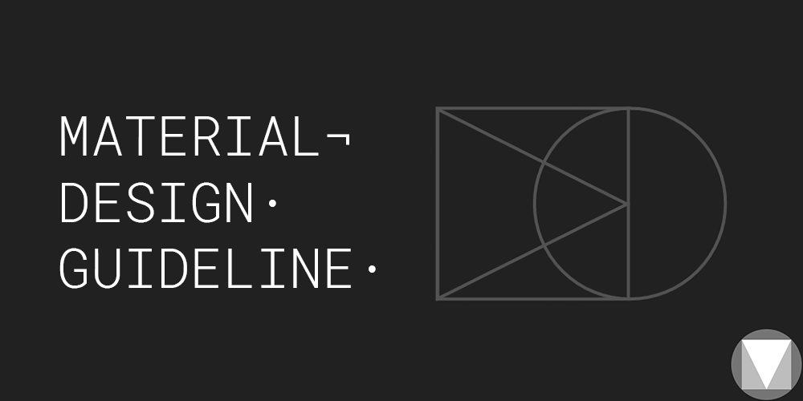
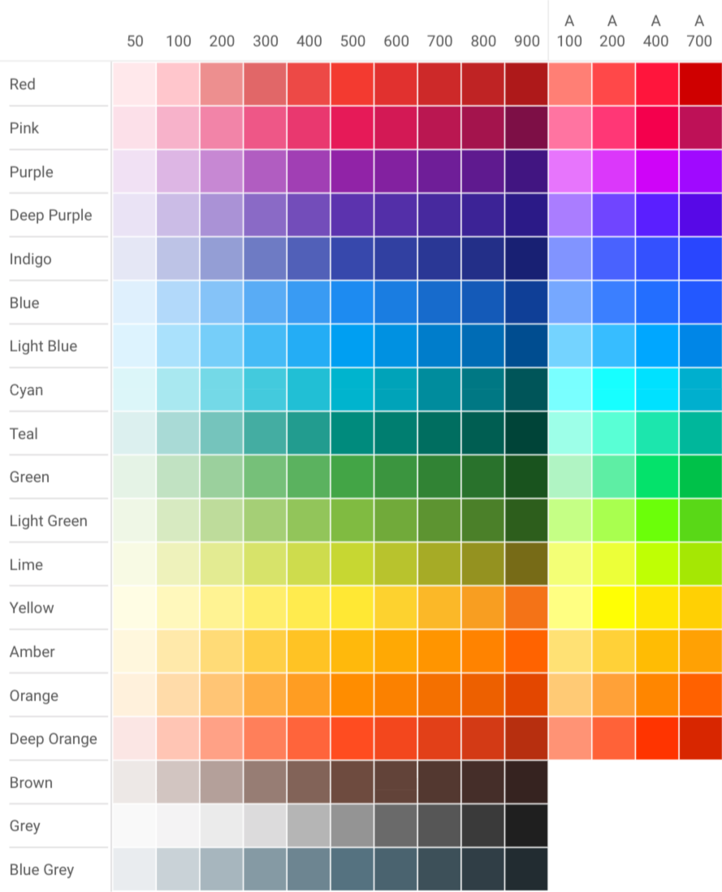
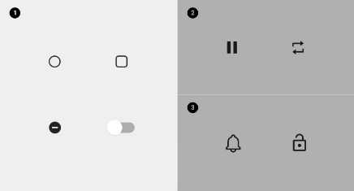

# **「 MATERIAL DESIGN GUIDELINE V.2 」**



[](https://travis-ci.org/TheKhaeng/material-design-guideline)
[ ](https://bintray.com/nonthawit/TheKhaeng/material-design-color/_latestVersion)
[ ](https://bintray.com/nonthawit/TheKhaeng/material-design-metric/_latestVersion)
[](https://android-arsenal.com/details/1/5557)


Very lightweight library for Android developers that facilitate how you use XML resources, especially if you strictly follow
Google material design principle. This library is mostly about XML resources. For example,
colors that is defined by the principle or dimension sizes that is divisible by `4dp`.
The guideline is here. [Google Material guideline V.2](https://material.io/).


### TOPIC

* Demo app
* Install
* Default color and dimens: margin and padding / corner / aspect / tablet device
* Color: base color / material color / alert color
* Icons: size / color
* Typography: size / font / space / color / style
* Elevation
* Elevation Anim
* Animation duration
* Component


## 「 DEMO APPLICATION 」

<a href="https://play.google.com/store/apps/details?id=th.co.thekhaeng.materialstyletemplate" target="_blank">

</a>


## 「 INSTALLATION 」

```gradle
implementation 'com.github.thekhaeng:material-design-color:2.0.0' //only material color

implementation 'com.github.thekhaeng:material-design-metric:2.0.0'

```


## Changelog

- **2.0.0: lastest version**
	 - **update all new Material Design**

- 1.0.4
    - Added **devices.xml** for check tablet (sw540dp)
    - Added **tablet font size** +1sp

- 1.0.3
    - Added **no transparent text and icon color**
    - Added **default_stroke_large**
    - Added **default_divider_large**

- 1.0.2
    - Added **some example usage in demo project**
    - Changed name **light to light_theme**
    - Changed name **dark to dark_theme**

- 1.0.1
    - Added **default_padding_margin_extra_extra_extra_large** 48dp
    - Changed **default_padding_margin_extra_extra_large** 48dp to 32dp

<br>
<br>
<br>

--------

<br>
<br>


# BEFORE START

This library uses **md_** or **material_** prefix name feel free to use.

#### Example

`md_icon_color_active_light_theme` or `material_icon_color_active_light_theme`


<br>
<br>
<br>

--------

<br>
<br>


# 「 DEFAULT COLOR AND DIMENS 」


### Dimens


#### Margin and Padding

Default values for margin, padding, and size to use in your XML layout.

**NOTE:** Based on material design principle **+4dp** **+8dp** **+16dp** or **+24dp**


**normal** size start at `8dp` (`R.dimen.default_padding_margin`)

**huge** size start at `48dp` (`R.dimen.default_padding_margin_huge`)

>x = +8dp

>h = +4dp

> example: xxx = 8 x 3dp = 24dp, xxxh = (8 x 3dp) + 4dp = 28dp

|DIMEN NAMES                    |VALUE  |
| ----------------------------- | -----:|
|**Normal**|
|default_padding_margin_small_x|2dp|
|default_padding_margin_small|4dp|
|default_padding_margin|8dp|
|default_padding_margin_h|12dp|
|default_padding_margin_x|16dp|
|default_padding_margin_xh|20dp|
|default_padding_margin_xx|24dp|
|default_padding_margin_xxh|28dp|
|default_padding_margin_xxx|32dp|
|default_padding_margin_xxxh|36dp|
|default_padding_margin_xxxx|40dp|
|default_padding_margin_xxxxh|44dp|
|**Huge**|
|default_padding_margin_huge|48dp|
|default_padding_margin_huge_x|56dp|
|default_padding_margin_huge_xh|60dp|
|default_padding_margin_huge_xx|64dp|
|default_padding_margin_huge_xxh|68dp|
|default_padding_margin_huge_xxx|72dp|
|default_padding_margin_huge_xxxh|76dp|
|default_padding_margin_huge_xxxx|80dp|

#### Corner

|DIMEN NAMES                    |VALUE  |
| ----------------------------- | -----:|
|default_round_corner_small|2dp|
|default_round_corner|4dp|
|default_round_corner_large|8dp|


#### Aspect


**Programatically**

**Aspect.kt** provides functions that return `float` of aspect.

```java
Aspect.to_16_9(context)
Aspect.to_3_2(context)
Aspect.to_4_3(context)
Aspect.to_1_1(context)
Aspect.to_3_4(context)
Aspect.to_2_3(context)
```

or you can use via **xml**

|DIMEN NAMES                    |FLOAT  |
| ----------------------------- | :-----|
| md_aspect_16_9 |1.7777777|
| md_aspect_3_2 |1.5|
| md_aspect_4_3 |1.333333|
| md_aspect_1_1 |1|


#### Tablet Device

This project use `sw540dp` **magic number** to seperate smart phone and tablet.  

```
[Kotlin]
Context.isTablet
Fragment.isTablet

[Java]
TabletDevice.isTablet(context)
TabletDevice.isTablet(Fragment.isTablet)
```
or

``` java
boolean isTabletSize = getResources().getBoolean(R.bool.isTablet);
```

<br>
<br>
<br>

--------

<br>
<br>

# [「 COLOR RESOURCE NAMES 」](https://material.io/guidelines/style/color.html#color-color-palette)


### Base Color

**Usage example**
```xml
<color name="your_background_overlay">@color/default_color_black_alpha_50</color>
```

|COLOR NAMES                    |VALUE  | PERCENT |
| ----------------------------- | :-----|:-------:|
|**Dark theme**|
|default_color_white_alpha_0|#00ffffff| 0% white |
|default_color_white_alpha_10|#10ffffff| 10% white |
|default_color_white_alpha_20|#33ffffff| 20% white |
|default_color_white_alpha_30|#4Dffffff| 30% white |
|default_color_white_alpha_40|#66ffffff| 40% white |
|default_color_white_alpha_50|#80ffffff| 50% white |
|default_color_white_alpha_60|#99ffffff| 60% white |
|default_color_white_alpha_70|#B3ffffff| 70% white |
|default_color_white_alpha_80|#CCffffff| 80% white |
|default_color_white_alpha_90|#E6ffffff| 90% white |
|default_color_white_alpha_90|#ffffffff| 100% white |
||
|**Light theme**|
|default_color_black_alpha_0|#00000000| 0% white |
|default_color_black_alpha_10|#10000000| 10% black |
|default_color_black_alpha_20|#33000000| 20% black |
|default_color_black_alpha_30|#4D000000| 30% black |
|default_color_black_alpha_40|#66000000| 40% black |
|default_color_black_alpha_50|#80000000| 50% black |
|default_color_black_alpha_60|#99000000| 60% black |
|default_color_black_alpha_70|#B3000000| 70% black |
|default_color_black_alpha_80|#CC000000| 80% black |
|default_color_black_alpha_90|#E6000000| 90% black |
|default_color_black_alpha_100 |#ff000000| 100% black |


### Material Color

You can use both **XML** or **Java class**.

 **XML:** ``` R.id.md_red400 ```

 **Java class:** ``` MaterialColor.RED400 ```





|COLOR NAMES                    |VALUE   |
| ----------------------------- | :-----:|
|md_scrim_color|#52000000|
|md_divider_black|#12000000|
|md_divider_white|#12FFFFFF|


#### ALERT COLOR

|COLOR NAMES                    |VALUE   |
| ----------------------------- | :-----:|
|md_alert_caution|md_yellow800|
|md_alert_error|md_red700|
|md_alert_success|md_green500|


<br>
<br>
<br>

--------

<br>
<br>

# [「 ICONS 」](https://material.io/guidelines/style/icons.html)


#### SIZE

> x = +12dp

|DIMEN NAMES                    |VALUE  |
| ----------------------------- | -----:|
|default_icon_size_small_x      | 12dp
|default_icon_size_small            | 16dp
|default_icon_size                  | 24dp
|default_icon_size_x            | 36dp
|default_icon_size_xx      | 48dp
|default_icon_size_xxx | 56dp
|**Stroke size** |
|default_stroke_large                     | 3dp
|default_stroke                     | 2dp
|default_stroke_small               | 1dp
|**Divider size** |
|default_divider_size_large               | 2dp
|default_divider_size               | 1dp

|DIMEN NAMES                    |VALUE  |
| ----------------------------- | -----:|
|md_icon_touch_size_small | 36dp |
|md_icon_touch_padding_small | 8dp |
|md_icon_touch_size | 48dp |
|md_icon_touch_padding | 12dp |
|md_icon_size | 24dp |
|md_avatar_size | 40dp |

### COLOR (for Dark theme)

|COLOR NAMES                    |VALUE  | PERCENT |
| ----------------------------- | :-----|:-------:|
|**Dark theme**|
|md_icon_color_active_dark_theme|#ffffffff| 100% white |
|md_icon_color_inactive_dark_theme|#8Affffff| 54% white |
|md_icon_color_disable_dark_theme|#61ffffff| 38% white |
| _No transparent_ |
|md_icon_color_active_black_theme_no_transparent|#ffffff|
|md_icon_color_inactive_black_theme_no_transparent|#8A8A8A|
|md_icon_color_disable_black_theme_no_transparent|#616161|
|  |
|**Light theme**|
|md_icon_color_active_light_theme|#DE000000| 87% black|
|md_icon_color_inactive_light_theme|#8A000000| 54% black|
|md_icon_color_disable_light_theme|#61000000| 38% black|
| _No transparent_ |
|md_icon_color_active_white_theme_no_transparent|#212121|
|md_icon_color_inactive_white_theme_no_transparent|#757575|
|md_icon_color_disable_white_theme_no_transparent|#9E9E9E|


### COLOR (for Light theme)

|COLOR NAMES                    |VALUE  | PERCENT |
| ----------------------------- | :-----|:-------:|
|md_icon_color_active_light_theme|#DE000000| 87% black|
|md_icon_color_inactive_light_theme|#8A000000| 54% black|
|md_icon_color_disable_light_theme|#61000000| 38% black|
| **No transparent** |
|md_icon_color_active_white_theme_no_transparent|#212121|
|md_icon_color_inactive_white_theme_no_transparent|#757575|
|md_icon_color_disable_white_theme_no_transparent|#9E9E9E|


### ALPHA
|DIMEN NAMES                    |FLOAT  |
| ----------------------------- | :-----|
|**Light theme**|
|md_alpha_icon_active_light_theme|0.87|
|md_alpha_icon_inactive_light_theme|0.54|
|md_alpha_icon_disable_light_theme|0.38|
|**Dark theme**|
|md_alpha_icon_active_dark_theme|1.0|
|md_alpha_icon_inactive_dark_theme|0.54|
|md_alpha_icon_disable_dark_theme|0.38|

### STYLE

You can use this style to change the normal view to `IconClick`.


```
IconClick.BlackActive
IconClick.BlackInActive
IconClick.BlackDisabled

IconClick.BlackActive.Small
IconClick.BlackInActive.Small
IconClick.BlackDisabled.Small

IconClick.WhiteActive
IconClick.WhiteInActive
IconClick.WhiteDisabled

IconClick.WhiteActive.Small
IconClick.WhiteInActive.Small
IconClick.WhiteDisabled.Smalld

```

Usage XML example

```
<AppCompatImageView
	style="@style/IconClick.BlackActive"
	...
</AppCompatImageView>

```


<br>
<br>
<br>

--------

<br>
<br>


# [「 Typography 」](https://material.io/guidelines/style/typography.html#typography-typeface)


### SIZE

> **NOTE :** for tablet font size +1sp

> **EX :** use "_tablet" suffix  **md_text_body_medium_tablet**


|DIMEN NAMES                            | TEXT STYLE  |VALUE  |
| ------------------------------------- | :----------:| -----:|
|md_text_size_headline_1_light  | light |96sp|
|md_text_size_headline_2_light  | light |60sp|
|md_text_size_headline_3_regular| **regular** |48sp|
|md_text_size_headline_4_regular| **regular** |34sp|
|md_text_size_headline_5_regular| **regular** |24sp|
|md_text_size_headline_6_medium | *medium*  |20sp|
|md_text_subtitle_1_regular     | **regular** |16sp|
|md_text_subtitle_2_medium      | *medium*  |14sp|
|md_text_body_1_regular         | **regular** |16sp|
|md_text_body_2_regular         | **regular** |14sp|
|md_text_button_medium          | *medium*  |14sp|
|md_text_caption_regular        | **regular** |12sp|
|md_text_overline_regular       | **regular** |10sp|


> **NOTE:** Body text comes in ranges 1-2, a serif or sans serif typeface is recommended. 
> 
> **serif** typeface is used for Body 1.
> 
> **sans serif** typeface is used for Body 2.
 


### FONT

There are two font is `roboto` and `product sans`. Feel free to use with all TextView in your project.

|FONT DIMEN NAMES                            | NORMAL  | BOLD  |
| ------------------------------------- | :----------:| :-----:|
| font_product_sans  | product_sans_regular |product_sans_bold|
| font_roboto_light | roboto_light | roboto_bold |
| font_roboto  | roboto_regular |roboto_bold|
| font_roboto_medium | roboto_medium | roboto_bold |

**Usage examples**

```
<AppCompatTextView>
	...
	android:textStyle="normal|bold"
	app:fontFamily="@font/font_product_sans"
	...
</AppCompatTextView>
```


### TEXT LINE SPACE


`TextSpace.kt` extension provides functions that you can cutomize text space.

```
[Kotlin]
textView.setLineHeight(float)
textView.scaleLineSpaceByTextSize(scale)

[Java]
TextSpace.setLineHeight(textView,float);
TextSpace.scaleLineSpaceByTextSize(textView, scale);

```


**Dense scripts**

ex. 中国 (chinese), 日本の (japan), and 한국의 (korean).

use [Noto CJK Font](https://www.google.com/get/noto/help/cjk/)

**Tall scripts**

South and Southeast Asian and Middle Eastern languages,

including اللغة العربية (arabic), हिन्दी (hindi), and ภาษาไทย (thai).

use [Noto Font](https://www.google.com/get/noto/)


### COLOR 
|COLOR NAMES                    |VALUE  | PERCENT |
| ----------------------------- | :-----|:-------:|
|**Light theme**|
|md_text_color_active_light_theme (primary)|#de000000|87% black|
|md_text_color_inactive_light_theme (secondary)|#99000000|60% black|
|md_text_color_disabled_light_theme (disabled)|#61000000|38% black|
| _No transparent_ |
|md_text_color_active_white_theme_no_transparent (primary)|#212121|
|md_text_color_inactive_white_theme_no_transparent (secondary)|#666666|
|md_text_color_disabled_white_theme_no_transparent (disabled)|#9E9E9E|
||
|**Dark theme**|
|md_text_color_active_dark_theme (primary)|#ffffffff|100% white|
|md_text_color_inactive_dark_theme (secondary)|#99ffffff| 60% white|
|md_text_color_disabled_dark_theme (disabled)|#61ffffff|50% white |
| _No transparent_ |
|md_text_color_active_black_theme_no_transparent (primary)|#ffffffff|
|md_text_color_inactive_black_theme_no_transparent (secondary)|#999999|
|md_text_color_disabled_black_theme_no_transparent (disabled)|#616161|


### ALPHA 
|DIMEN NAMES                    |FLOAT  |
| ----------------------------- | :-----|
|**Light theme**|
|md_alpha_text_active_light_theme|0.87|
|md_alpha_text_inactive_light_theme|0.60|
|md_alpha_text_disable_light_theme|0.38|
||
|**Dark theme**|
|md_alpha_text_active_dark_theme|1.0|
|md_alpha_text_inactive_dark_theme|0.60|
|md_alpha_text_disable_dark_theme|0.38|


### STYLE

It is a lot of style you can checkout [here](./material-design-guideline/src/main/res/values).

```
styles_text_material_product_sans_black.xml
styles_text_material_product_sans_white.xml
styles_text_material_roboto_black.xml
styles_text_material_roboto_white.xml
```

Usage XML example

```
<AppCompatTextView
	style="@style/MaterialTextView.Roboto.BlackInactive.Body1"
	...
</AppCompatTextView>

```


<br>
<br>
<br>

--------

<br>
<br>

# [「 Elevation 」](https://material.io/guidelines/material-design/elevation-shadows.html#elevation-shadows-elevation-android)


|DIMEN NAMES                    | ELEVATION |
| ----------------------------- | :----------:|
|md_elevation_dialog|24dp|
|||
|md_elevation_navigation_drawer|16dp|
|md_elevation_side_sheet_modal|16dp|
|md_elevation_bottom_sheet_modal|16dp|
|||
|md_elevation_fab_pressed|12dp|
|||
|md_elevation_side_sheet_standard|8dp|
|md_elevation_bottom_sheet_standard|8dp|
|md_elevation_bottom_navigation_bar|8dp|
|md_elevation_bottom_app_bar|8dp|
|md_elevation_menu|8dp|
|md_elevation_sub_menu|8dp|
|md_elevation_button_pressed|8dp|
|md_elevation_card_pressed|8dp|
|||
|md_elevation_fab|6dp|
|md_elevation_snackbar|6dp|
|||
|md_elevation_top_app_bar_scrolled_state|4dp|
|md_elevation_top_app_bar(_no_elevation)|4dp or 0dp|
|md_elevation_toolbar|4dp|
|||
|md_elevation_refresh_indicator|3dp|
|md_elevation_search_bar_scrolled_state|3dp|
|||
|md_elevation_button|2dp|
|||
|md_elevation_card|1dp|
|md_elevation_search_bar|1dp|
|md_elevation_switch|1dp|
|||
|md_elevation_text_button|0dp|
|md_elevation_standard_side_sheet|0dp|


## [「 Elevation Anim 」](https://material.io/guidelines/material-design/elevation-shadows.html#elevation-shadows-elevation-android)

> **NOTE:** Animations are only available starting from API level 21

**Usage example**

```xml
<View
    ...
    android:layout_width="wrap_content"
    android:layout_height="wrap_content"
    android:clickable="true"
    android:stateListAnimator="@drawable/md_selector_anim_cardview_elevation"
    ... />
```


**Drawable names**

```java
R.drawable.md_selector_anim_button_elevation
R.drawable.md_selector_anim_cardview_elevation
```


<br>
<br>
<br>

--------

<br>
<br>

# [Animation Duration](https://material.io/design/iconography/animated-icons.html#transitions)

### Icon

Most icons will fit into these three groups of recommended durations:

- Simple icon animations: `100ms`
- Average icon animations: `200ms`
- Complex icon animations: `500ms`



|INTEGER NAMES                    | Integer (millisecond) |
| ----------------------------- | :----------:|
|md_anim_duration_icon_simple|100|
|md_anim_duration_icon_average|200|
|md_anim_duration_icon_complex|500|


<br>
<br>
<br>

--------

<br>
<br>

# COMPONENT

<br>

### BUTTON

|DIMEN NAMES                    |VALUE  |
| ----------------------------- | -----:|
|md_button_height|36dp|
|md_button_height|42dp|
|md_button_min_width|72dp|

<br>

### TABLAYOUT

|DIMEN NAMES                    |VALUE  |
| ----------------------------- | -----:|
|md_tab_layout_height|48dp|
|md_tab_layout_with_icon_height|72dp|

<br>

### TOOLBAR

|DIMEN NAMES                    |VALUE  |
| ----------------------------- | :----------:|
|md_toolbar_height|56dp or 64dp (tablet)|

If you want to get status bar or SystemUI height we recommend you to use `OnSystemUISpaceListener` listener like this.

```
interface OnSystemUISpaceListener {
    fun onSpace(top: Int, left: Int, right: Int, bottom: Int)
}

[Kotlin]
FragmentActivity.setOnSystemUISpaceListener(OnSystemUISpaceListener)
Fragment.setOnSystemUISpaceListener(OnSystemUISpaceListener)

[Java]
SystemUISpace.setOnSystemUISpaceListener(FragmentActivity, OnSystemUISpaceListener);
SystemUISpace.setOnSystemUISpaceListener(Fragment, OnSystemUISpaceListener);
```

### SystemUISpaceView

This view will `spacing` size equal SystemUI in your applciation for example **status bar** and **navigation bar**. You can consume insets or not.

```xml
<com.thekhaeng.systemui.view.SystemUISpaceView
	 ...
    style="@style/SystemUISpace.Top|Bottom|Left|Right"
    android:layout_gravity="top|bottom|left|right"
    app:isConsumeInsets="true|false"
    ...
    />
```

 
<br>
<br>
<br>

--------

<br>
<br>


# Licence

Copyright 2017 TheKhaeng

Licensed under the Apache License, Version 2.0 (the "License"); you may not use this work except in compliance with the License. You may obtain a copy of the License in the LICENSE file, or at:

http://www.apache.org/licenses/LICENSE-2.0

Unless required by applicable law or agreed to in writing, software distributed under the License is distributed on an "AS IS" BASIS, WITHOUT WARRANTIES OR CONDITIONS OF ANY KIND, either express or implied. See the License for the specific language governing permissions and limitations under the License.


### Developed By Thai android developer.

 


Follow [facebook.com/thekhaeng.io](https://www.facebook.com/thekhaeng.io) on Facebook page.
or [@nonthawit](https://medium.com/@nonthawit) at my Medium blog. :)

For contact, shoot me an email at nonthawit.thekhaeng@gmail.com


